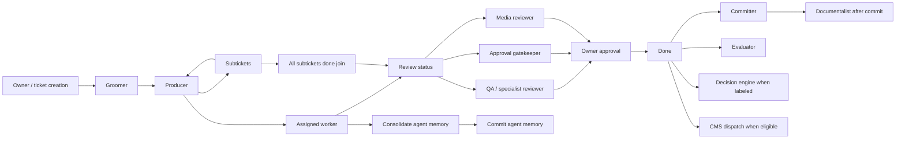

# Analyze GigaClaw agent patterns

> I want you to do a deep dive analysis of GigaClaw, and then of [https://github.com/Filimindji/awesome-claude-code](https://github.com/Filimindji/awesome-claude-code) , [https://github.com/wshobson/agents](https://github.com/wshobson/agents), [https://github.com/aaron-he-zhu/aaron-marketing-skills](https://github.com/aaron-he-zhu/aaron-marketing-skills) , and [https://github.com/ruvnet/ruflo](https://github.com/ruvnet/ruflo) using opus, sonnet, and haiku subagents to help speed up the process. Answer these questions:
>
> What agents does GigaClaw have, how are they used and organized, what automations exists and how do they link between agents. Comparing all the repos, ask the same questions, what agents do they have, how are they used and organized, what automations exists and how do they link agents together.
>
> Identify patterns, and agent teams and come up with a list of agents, teams, patterns, automations, optimizations, that those repos have that we can leverage to improve and increase functionality of gigaclaw. Are there teams and use cases that gigaclaw doesn't cover? are there agents, automations and patterns that gigaclaw does cover but can be improved after observing how others do the same tasks.
>
> For each category (agents, teams, patterns, automtions, optimizations) Create a table of what you find, the source (file or files), and give them a ranking on a scale of 1 if gigaclaw does it better, 2 if they are about the same, no real value in changing, 3 if it would be a decent improvement, 4 if it is a big improvement, 5 if it covers a blind spot GigaClaw has

2 previous messages

> I’m using the GitHub repository-analysis skill because this is a source-level comparison across five codebases. I’ll split the external repos among subagents in parallel, then synthesize their findings against a direct audit of GigaClaw. The exact “Opus/Sonnet/Haiku” model labels aren’t exposed in this environment, so I’ll use the available frontier and balanced subagent models and vary reasoning depth to approximate those roles.
>
> 

Ran 3 commands

>
> - Ran `pwd && (rg --files -g 'AGENTS.md' -g 'SKILL.md' . .agents .codex 2>/dev/null | sed -n '1,120p') && sed -n '1,260p' '/Users/pedrozabala/.codex/plugins/cache/openai-curated-remote/github/0.1.8-2841cf9749ae/skills/github/SKILL.md'`
> - Ran `find .. -name AGENTS.md -print 2>/dev/null | sed -n '1,80p'; git status --short; git remote -v; find . -maxdepth 3 -type f | sed 's#^./##' | sort | sed -n '1,260p'`
> - Ran `git clone --depth 1 https://github.com/Filimindji/awesome-claude-code.git /private/tmp/awesome-claude-code && git clone --depth 1 https://github.com/wshobson/agents.git /private/tmp/wshobson-agents && git clone --depth 1 https://github.com/aaron-he-zhu/aaron-marketing-skills.git /private/tmp/aaron-marketing-skills && git clone --depth 1 https://github.com/ruvnet/ruflo.git /private/tmp/ruflo`
>
> 

> you caught the change i was going to make of use your own frontier and balanced sub agent models , g ahead and continue

10 previous messages

> Caught it—the four external repositories are already cloned into temporary workspaces. I’m continuing with frontier and balanced subagents now, with the frontier agent on the largest orchestration framework, a second frontier pass on the agent catalog, and a balanced fast pass across the two skills/catalog repositories.
>
> 

Explored 13 files, 6 searches, 2 lists, ran 8 commands

>
> 

Explored 2 searches, a list

>
> - Listed files in `ProjectTemplate`
> - Searched for `*team*` in `.`
> - Searched for `AgentTeam|Team|team|Automation|automation|TriggerType|ActionType|AgentName|agentName|Agent` in `GigaClaw.Core`
>
> 

>
> - Ran `jq '{count:(.automations|length), ids:[.automations[]|{id,name,enabled,trigger:.trigger.type,conditions:[.conditions[]?.type],actions:[.actions[]?.type]}]}' ProjectTemplate/Agents/automations.json; sed -n '1,260p' GigaClaw.Core/Models/AgentTeam.cs; sed -n '1,320p' GigaClaw.Core/Services/AgentTeamService.cs; sed -n '1,300p' GigaClaw.Core/Automation/AutomationConfig.cs`
>
> 

Explored 5 files

>
> - Read `./GigaClaw.Core/Automation/AutomationConfig.cs`
> - Read `./GigaClaw.Core/Services/AgentTeamService.cs`
> - Read `./GigaClaw.Core/Automation/AutomationConfig.cs`
> - Read `./doc/automation-engine.md`
> - Read `./doc/agent-dispatch.md`
>
> 

>
> - Ran `for f in ProjectTemplate/Agents/*/SKILL.md; do d=${f%/SKILL.md}; printf '%s\t' "${d##*/}"; awk 'NR==1{sub(/^# +/,""); print; exit}' "$f"; done | sort; printf '\nAgent count: '; find ProjectTemplate/Agents -mindepth 2 -maxdepth 2 -name SKILL.md | wc -l; printf '\nHandoff/automation excerpts:\n'; rg -n "automation|dispatch|handoff|hand off|assign|Review|Todo|Blocked|Done|sub-ticket|subticket|pipeline|gate|invoke|team|delegat|parallel" ProjectTemplate/Agents/*/SKILL.md | sed -n '1,1000p'`
>
> - Ran `for f in ProjectTemplate/Agents/*/SKILL.md; do slug=${f#ProjectTemplate/Agents/}; slug=${slug%/SKILL.md}; printf '\n### %s\n' "$slug"; sed -n '1,18p' "$f"; done`
>
> - Ran `rg -n "approval-gatekeeper|content-writer|wellness-coach|new Member|DefaultMembers|Member\(" GigaClaw.Core GigaClaw.Web ProjectTemplate README.md -g '*.cs' -g '*.json' -g '*.md' | sed -n '1,500p'; nl -ba GigaClaw.Core/Services/AgentsTemplateService.cs | sed -n '1,320p'; nl -ba GigaClaw.Web/Api/Endpoints.Projects.cs | sed -n '1,360p' 2>/dev/null || true`
>
> - Ran `jq . ProjectTemplate/Agents/models.json; jq . ProjectTemplate/Agents/contracts.json; nl -ba ProjectTemplate/Agents/preamble.md | sed -n '1,320p'; nl -ba ProjectTemplate/Agents/memory-consolidation.md | sed -n '1,320p'`
>
> - Ran `jq -r '.automations[] | "\n## " + .id + "\nname=" + (.name//"") + "\nenabled=" + (.enabled|tostring) + "\ntrigger=" + (.trigger|tojson) + "\nconditions=" + (.conditions|tojson) + "\nactions=" + (.actions|tojson)' ProjectTemplate/Agents/automations.json`
>
> 

Explored 2 files, 2 searches, a list

>
> - Searched for `Resolve.*Model|DefaultModel|FallbackModel|Quota|quota|Model =|action.Model|spec.Model|LocalModel|Ollama|fallback` in `Automation`
> - Read `./GigaClaw.Core/Automation/ActionExecutor.cs`
> - Read `./GigaClaw.Core/Automation/ClaudeRunner.cs`
> - Listed files in `doc`
> - Searched for `local media|LocalMedia|MediaJob|dashboard|scheduled|promotion|worktree|agent team|contracts.json|models.json` in `doc`
>
> 

>
> - Ran `git rev-parse HEAD; git branch --show-current; for d in /private/tmp/awesome-claude-code /private/tmp/wshobson-agents /private/tmp/aaron-marketing-skills /private/tmp/ruflo; do printf '%s\t' "$d"; git -C "$d" rev-parse HEAD; done; git status --short`
>
> 

Explored 9 files, 2 searches

>
> - Searched for `"id": "` in `automations.json`
> - Searched for `"[a-z-]+": \{` in `contracts.json`
> - Read `./doc/local-media.md`
> - Read `./doc/worktree-workflow.md`
> - Read `./doc/project-template.md`
> - Read `./doc/local-models.md`
> - Read `./GigaClaw.Core/Automation/ClaudeRunner.cs`
> - Read `./GigaClaw.Core/Automation/ActionExecutor.cs`
> - Read `./GigaClaw.Core/Automation/RunStateManager.cs`
> - Read `./GigaClaw.Core/Automation/RunConcurrencyGate.cs`
> - Read `./GigaClaw.Core/Automation/ConcurrencyLockReaper.cs`
>
> 

>
> - Ran `for d in /private/tmp/awesome-claude-code /private/tmp/wshobson-agents /private/tmp/aaron-marketing-skills /private/tmp/ruflo; do echo "$d"; printf 'files '; git -C "$d" ls-files | wc -l; printf 'dirs '; find "$d" -type d | wc -l; printf 'markdown '; git -C "$d" ls-files '*.md' | wc -l; printf 'yaml/json '; git -C "$d" ls-files '*.yaml' '*.yml' '*.json' | wc -l; done`
>
> 

>
> The first parallel audit is in. One important distinction is already clear: `awesome-claude-code` is a discovery catalog, not an orchestration implementation, while the marketing repository has unusually strong typed handoffs, workflow-graph validation, and evidence/recovery contracts—but no scheduler comparable to GigaClaw. I’m validating those mechanisms against GigaClaw’s actual runtime before ranking them.
>
> 

Explored 22 files, 7 searches, 2 lists, ran 7 commands

>
> 

Explored a file, 3 searches, a list

>
> - Read `/private/tmp/wshobson-agents/README.md`
> - Listed files in `wshobson-agents`
> - Searched for `*/agents/*.md` in `wshobson-agents`
> - Searched for `*/commands/*.md` in `wshobson-agents`
> - Searched for `*/skills/*/SKILL.md` in `wshobson-agents`
>
> 

>
> - Ran `find /private/tmp/wshobson-agents/plugins/agent-teams -type f -maxdepth 4 -print | sort; sed -n '1,320p' /private/tmp/wshobson-agents/plugins/agent-teams/README.md; find /private/tmp/wshobson-agents/plugins/agent-orchestration -type f -maxdepth 4 -print | sort | sed -n '1,220p'; sed -n '1,320p' /private/tmp/wshobson-agents/plugins/agent-orchestration/agents/*.md 2>/dev/null | sed -n '1,600p'`
>
> - Ran `nl -ba /private/tmp/wshobson-agents/plugins/agent-teams/commands/team-spawn.md | sed -n '1,340p'; nl -ba /private/tmp/wshobson-agents/plugins/agent-teams/agents/team-lead.md | sed -n '1,320p'; nl -ba /private/tmp/wshobson-agents/plugins/agent-teams/skills/team-composition-patterns/references/preset-teams.md | sed -n '1,320p'; nl -ba /private/tmp/wshobson-agents/plugins/full-stack-orchestration/agents/*.md | sed -n '1,500p' 2>/dev/null || true; find /private/tmp/wshobson-agents/plugins -maxdepth 3 -type d -name agents | sed -n '1,160p'`
>
> - Ran `for f in /private/tmp/wshobson-agents/plugins/full-stack-orchestration/agents/*.md; do echo "### $f"; sed -n '1,280p' "$f"; done; find /private/tmp/wshobson-agents/plugins/incident-response -maxdepth 3 -type f | sort; find /private/tmp/wshobson-agents/plugins/comprehensive-review -maxdepth 3 -type f | sort; find /private/tmp/wshobson-agents/plugins/plugin-eval -maxdepth 3 -type f | sort | sed -n '1,240p'`
>
> - Ran `printf 'contract agents '; jq '.agents|length' ProjectTemplate/Agents/contracts.json; printf 'team unique '; sed -n '1,120p' GigaClaw.Core/Services/AgentTeamService.cs | rg -o '"[a-z][a-z-]+"' | tr -d '"' | sort -u | wc -l; printf 'agents absent from contracts: '; comm -23 <(find ProjectTemplate/Agents -mindepth 2 -maxdepth 2 -name SKILL.md -exec dirname {} \; | xargs -n1 basename | sort) <(jq -r '.agents|keys[]' ProjectTemplate/Agents/contracts.json | sort) | tr '\n' ' '; printf '\nagents absent from teams: '; comm -23 <(find ProjectTemplate/Agents -mindepth 2 -maxdepth 2 -name SKILL.md -exec dirname {} \; | xargs -n1 basename | sort) <(sed -n '1,120p' GigaClaw.Core/Services/AgentTeamService.cs | rg -o '"[a-z][a-z-]+"' | tr -d '"' | sort -u) | tr '\n' ' '; echo`
>
> - Ran `jq '[.automations[]|select(.id=="assignee-dispatch")|.conditions[]|select(.type=="assignedTo")|.slugs[]]|length' ProjectTemplate/Agents/automations.json; jq '[.automations[]|select(.id=="assignee-resume")|.conditions[]|select(.type=="assignedTo")|.slugs[]]|length' ProjectTemplate/Agents/automations.json`
>
> 

Explored 7 files, 2 searches, a list

>
> - Read `./doc/automation-drift-check.md`
> - Read `./tools/check-automation-drift.sh`
> - Read `./.github/workflows/ci.yml`
> - Searched for `automations.json|contracts.json|SKILL.md|ProjectTemplate` in `.github`
> - Read `./GigaClaw.Core.Tests/Automation/TemplateAutomationContractTests.cs`
> - Read `./GigaClaw.Core.Tests/Services/AgentTeamServiceTests.cs`
> - Read `./GigaClaw.Core.Tests/Services/AgentsTemplateServiceTests.cs`
> - Read `/private/tmp/ruflo/README.md`
> - Listed files in `ruflo`
> - Searched for `agent|swarm|topolog|orchestrat|workflow|hook|memory|routing|consensus|hierarch|mesh|queen|worker` in `README.md`
>
> 

>
> - Ran `find /private/tmp/ruflo -maxdepth 3 -type f -name package.json -print | sort | sed -n '1,260p'; find /private/tmp/ruflo -maxdepth 3 -type d | sed 's#/private/tmp/ruflo##' | sort | sed -n '1,500p'; jq '{workspaces,scripts}' /private/tmp/ruflo/package.json; rg -n "class .*Swarm|createSwarm|swarm_init|agent_spawn|consensus|topology" /private/tmp/ruflo/v3 /private/tmp/ruflo/ruflo /private/tmp/ruflo/packages -g '*.ts' -g '*.js' 2>/dev/null | sed -n '1,700p'`
>
> - Ran `rg -n '^## |^### ' /private/tmp/wshobson-agents/docs/agents.md | sed -n '1,240p'; sed -n '1,260p' /private/tmp/wshobson-agents/docs/agents.md; rg -n '^## |^### ' /private/tmp/aaron-marketing-skills/README.md | sed -n '1,220p'; rg -n '^## |^### ' /private/tmp/ruflo/docs/agents.md /private/tmp/ruflo/docs/USERGUIDE.md /private/tmp/ruflo/README.md 2>/dev/null | sed -n '1,300p'`
>
> 

Explored 15 files, 2 searches

>
> - Read `./GigaClaw.Core/Models/Ticket.cs`
> - Read `./GigaClaw.Core/Models/Member.cs`
> - Searched for `Depends|dependency|blockedBy|blocks|ParentId|SubTicket` in `GigaClaw.Core`
> - Searched for `Tool|tools|allowedWriteGlobs|dangerously-skip-permissions|permission` in `GigaClaw.Core`
> - Read `/private/tmp/aaron-marketing-skills/README.md`
> - Read `/private/tmp/aaron-marketing-skills/references/runtime-protocol.md`
> - Read `/private/tmp/aaron-marketing-skills/docs/workflow-graph.md`
> - Read `/private/tmp/aaron-marketing-skills/commands/auto.md`
> - Read `/private/tmp/aaron-marketing-skills/AGENTS.md`
> - Read `./ProjectTemplate/Agents/models.json`
> - Read `./ProjectTemplate/Agents/automations.json`
> - Read `./GigaClaw.Core/Automation/ClaudeRunner.cs`
> - Read `/private/tmp/wshobson-agents/README.md`
> - Read `/private/tmp/wshobson-agents/docs/agents.md`
> - Read `/private/tmp/wshobson-agents/docs/architecture.md`
> - Read `/private/tmp/wshobson-agents/docs/plugin-eval.md`
> - Read `/private/tmp/wshobson-agents/.github/workflows/validate.yml`
>
> 

>
> 

>
> Context compaction
>
> Source: automatic
> Status: completed
>
> The local GigaClaw inventory and the Awesome/Aaron comparison are complete. I’m now consolidating the two frontier audits—Wshobson’s agent ecosystem and Ruflo’s swarm runtime—then I’ll score every finding against GigaClaw’s actual implementation, not just the projects’ README claims.
>
> 

Explored 7 files, ran 6 commands

>
> - Ran `git rev-parse HEAD && rg -n 'new AgentTeam|Name =|AgentSlugs' GigaClaw.Core/Services/AgentTeamService.cs && rg -n 'dangerously-skip-permissions|allowedWriteGlobs|modelOverride|member.*Model' GigaClaw.Core/Automation/ClaudeRunner.cs GigaClaw.Core/Automation/ActionExecutor.cs ProjectTemplate/Agents/models.json | head -80`
>
> 

Explored 4 files

>
> - Read `./GigaClaw.Core/Services/AgentTeamService.cs`
> - Read `./ProjectTemplate/Agents/models.json`
> - Read `./GigaClaw.Core/Automation/ClaudeRunner.cs`
> - Read `./GigaClaw.Core/Automation/ActionExecutor.cs`
>
> 

>
> - Ran `jq -r '.automations[] | [.id,.name,.trigger.type,([.actions[].type]|join("+")),(.enabled|tostring)] | @tsv' ProjectTemplate/Agents/automations.json
> find ProjectTemplate/Agents -mindepth 2 -maxdepth 2 -name SKILL.md -print | sort | sed 's#ProjectTemplate/Agents/##;s#/SKILL.md##'`
>
> - Ran `git -C /private/tmp/ruflo rev-parse HEAD
> rg -n '100\+|98 agents|60\+|30 skills|topolog|hierarchical|mesh|adaptive|MCP|hooks|workers|federat|memory|Q-learning|Thompson|ReasoningBank|Byzantine|RAFT|CRDT|consensus' /private/tmp/ruflo/README.md /private/tmp/ruflo/docs/USERGUIDE.md | head -180`
>
> - Ran `git -C /private/tmp/wshobson-agents rev-parse HEAD
> rg -n '94 plugins|203 agents|175 skills|109 commands|16 orchestrators|Agent Teams|progressive|Model|generated|Claude Code|Codex|Cursor|OpenCode|Gemini|Copilot' /private/tmp/wshobson-agents/README.md | head -100
> nl -ba /private/tmp/wshobson-agents/plugins/agent-teams/agents/team-lead.md | sed -n '1,105p'
> nl -ba /private/tmp/wshobson-agents/plugins/agent-teams/commands/team-spawn.md | sed -n '1,120p'`
>
> - Ran `rg -n 'Monte Carlo|50|100|LLM.*judge|static|confidence interval|Wilson|bootstrap|dimension|scor' /private/tmp/wshobson-agents/docs/plugin-eval.md /private/tmp/wshobson-agents/plugins/plugin-eval/README.md 2>/dev/null | head -160
> rg -n 'validate|generate|drift|smoke|Claude|Codex|Gemini|OpenCode|Cursor|Copilot' /private/tmp/wshobson-agents/.github/workflows/validate.yml | head -120`
>
> 

Explored 3 files

>
> - Read `./GigaClaw.Core.Tests/Automation/TemplateAutomationContractTests.cs`
> - Read `./doc/automation-engine.md`
> - Read `./doc/worktree-workflow.md`
>
> 

>
> - Ran `rg -n 'export (type|interface).*Topology|type SwarmTopology|SwarmTopology|Consensus|Byzantine|Raft|Gossip|CRDT|Quorum' /private/tmp/ruflo/v3/@claude-flow/shared/src/types/swarm.types.ts /private/tmp/ruflo/v3/@claude-flow/core/src /private/tmp/ruflo/v3/@claude-flow/mcp/src 2>/dev/null | head -180
> rg -n 'Thompson|Beta\(|hooks_model|model-route|bandit' /private/tmp/ruflo/v3 /private/tmp/ruflo/ruflo 2>/dev/null | head -100
> rg -n 'Background.*Worker|worker.*trigger|12.*worker|audit|optimize|testgaps' /private/tmp/ruflo/v3/@claude-flow /private/tmp/ruflo/plugins/ruflo-loop-workers 2>/dev/null | head -140`
>
> 

>
> One important distinction has emerged: Wshobson’s repository is much larger than its published catalog (204 local agent definitions in the audited snapshot), but most workflows are host-executed Markdown recipes. GigaClaw’s smaller system is stronger as a durable scheduler; the valuable imports are specialist coverage, dynamic team presets, file ownership/dependency rules, and agent-quality evaluation.
>
> 

Ran a command

>
> - Ran `nl -ba /private/tmp/ruflo/v3/@claude-flow/cli/src/commands/agent.ts | sed -n '45,75p'
> for f in /private/tmp/ruflo/v3/@claude-flow/cli/agents/*.yaml; do basename "$f" .yaml; done
> nl -ba /private/tmp/aaron-marketing-skills/README.md | sed -n '23,42p;80,91p;137,174p;178,192p'
> nl -ba /private/tmp/awesome-claude-code/README.md | sed -n '49,68p;77,126p'`
>
> 

>
> 

Plan

>
> Completed the GigaClaw source inventory: 33 contract-covered agent skills, 8 specialty team filters, 29 seeded automations, runtime triggers/conditions/actions, memory/model/concurrency/cost paths, local-media queue, and the current test/drift safeguards. Two external audits remain in progress.
>
> - [x] Inventory GigaClaw agents, teams, automations, runtime linkages, and optimizations from source
> - [ ] Collect and validate parallel audits of the four external repositories
> - [ ] Build ranked comparison tables for agents, teams, patterns, automations, and optimizations
> - [ ] Synthesize gaps, overlaps, and a prioritized GigaClaw improvement roadmap with source links
>
> 

# Executive conclusion

GigaClaw already has the strongest actual orchestration runtime of the five projects: persistent tickets, subprocess execution, live output, resumable sessions, retries, concurrency controls, budgets, human approval, memory consolidation, and event-driven automation.

The largest opportunities are:

1. Runtime-enforced agent permissions and contracts.
2. Executable teams with parallel fan-out/fan-in, dependency graphs, claims, and file ownership.
3. Security, platform/SRE, incident-response, architecture/database, and full-funnel marketing teams.
4. Typed handoff artifacts, workflow graphs, and machine-verifiable gates.
5. Hybrid semantic memory and evidence-grounded agent/model routing.
6. First-class worktrees, CI, merge queues, and integration gates.
7. Modular agent packs, progressive disclosure, cross-harness adapters, and agent-quality evaluation.

The key architectural recommendation is: keep GigaClaw as the durable control plane; import the other repositories’ best coordination, governance, specialization, and intelligence patterns into that runtime.

The ranking below measures coverage difference, not implementation priority:

- 1: GigaClaw is better.
- 2: Approximately equal or not worth changing.
- 3: Decent improvement.
- 4: Major improvement.
- 5: GigaClaw blind spot.

Source snapshots were audited at:

- GigaClaw: `9348a46`
- awesome-claude-code: `432151c`
- wshobson/agents: `c4b82b0`
- aaron-marketing-skills: `fc66c03`
- Ruflo: `503b647`

## GigaClaw today

### Agents

GigaClaw contains 33 packaged agents, all represented in [`contracts.json`](<./ProjectTemplate/Agents/contracts.json:1>).

| Area | Agents |
|---|---|
| Software engineering | `programmer`, `groomer`, `producer`, `qa-tester`, `committer`, `code-janitor`, `evaluator`, `documentalist` |
| Content | `blog-researcher`, `blog-writer`, `blog-reviewer`, `blog-seo`, `blog-translator`, `content-writer` |
| Growth | `growth-writer`, `lead-magnet-creator`, `trend-researcher`, `email-copywriter` |
| UX/design | `design-researcher`, `ui-designer`, `ui-auditor` |
| Data/intelligence | `data-analyst`, `competitive-analyst` |
| Governance | `approval-gatekeeper`, `system-watchdog`, `decision-engine` |
| Local media | `local-media-director`, `local-image-artist`, `local-motion-artist`, `local-media-compositor`, `local-media-reviewer` |
| Health/editorial | `wellness-coach`, `content-series-planner` |

The 8 specialty teams are Software Engineering, Content Engine, Growth Marketing, UX & Product Design, Data & Intelligence, Governance & Ops, Health & Performance, and Local Media Creation. However, these are currently static member filters, not executable team definitions. [`AgentTeamService.cs`](<./GigaClaw.Core/Services/AgentTeamService.cs:17>) demonstrates that filtering behavior.

One concrete defect: `content-writer` is the only agent missing from every specialty team.

### Automations

GigaClaw ships 29 template automations—28 active and one disabled example—in [`automations.json`](<./ProjectTemplate/Agents/automations.json:1>).

| Automation group | Automations |
|---|---|
| Dispatch/resume | `assignee-dispatch`, `groomer`, `assignee-resume`, `owner-feedback` |
| Decomposition/quality/completion | `producer-on-subtick`, `auto-review-on-all-subs-done`, `qa-on-review`, `committer-on-done`, `evaluator-on-done`, `decision-receipt-on-done` |
| Maintenance/monitoring | `code-janitor-nightly`, `documentalist-on-commit`, `system-watchdog-hourly`, `stale-blocked-nudge` |
| Content/CMS | `blog-reviewer-on-review`, `blog-translation-on-seo-review`, `content-writer-on-inprogress`, `content-writer-resume`, `content-reviewer-on-review`, `trend-brief-weekly`, `cms-dispatch-on-done`, `auto-approve-ungated` |
| Design/media | `ui-audit-on-review`, `local-media-reviewer-on-review` |
| Approval lifecycle | `growth-approval-on-review`, `approval-gate-on-review`, `approval-clear-on-revision`, `approval-mark-on-done` |
| Example | `weekly-ticket-example`—disabled |

The engine supports 8 triggers, 9 current condition types, and 10 actions. It also provides persisted cron state, action-chain serialization, retries, backoff, exhaustion escalation, concurrency groups, output-to-input chain values, and memory commits. See [`automation-engine.md`](<./doc/automation-engine.md:21>).

### How GigaClaw links agents

Coordination is durable but indirect: ticket status, assignee, comments, labels, subtickets, hashes, and artifacts link agents together. There is no first-class direct messaging, team lifecycle, dependency DAG, or claim/lease model.

## Repository-by-repository comparison

| Repository | Actual inventory | Organization and usage | Automation/linking reality |
|---|---|---|---|
| **GigaClaw** | 33 agents, 29 automations, 8 specialty filters | Agents are executable skills with contracts, persistent runs, tickets, sessions, budgets, memory, and UI | Strongest durable engine. Agents link through tickets, statuses, comments, subtickets, labels, artifacts, and event triggers |
| **awesome-claude-code** | 0 implemented agents, teams, or automations | Static curated resource list organized into orchestration, skills, plugins, tools, infrastructure, observability, SDKs, and guides | No runtime. Useful only as a discovery catalog; descriptions are not validation. [Source](https://github.com/Filimindji/awesome-claude-code/blob/432151c17c225d30fc97d6df56102a451208d069/README.md#L51-L65) |
| **wshobson/agents** | Source audit: 95 marketplace entries, 204 local agent files, 180 skills, 109 commands. Published README says 94/203/175/109 | Broad plugin catalog covering 26 categories. Progressive-disclosure skills and cross-harness generation. Four team roles and seven team presets | Most workflows are Markdown instructions executed by the host. Claude’s experimental Agent Teams provides actual team processes. No resident ticket scheduler or retry engine. [Inventory](https://github.com/wshobson/agents/blob/c4b82b0ad771190355eb8e204b1329732a18449a/README.md#L1-L5), [teams](https://github.com/wshobson/agents/blob/c4b82b0ad771190355eb8e204b1329732a18449a/plugins/agent-teams/commands/team-spawn.md#L22-L70) |
| **Aaron Marketing Skills** | 120 skills: 7 disciplines × 16 plus 8 protocol skills; 8 commands, 7 registries, 8 auditor gates | Marketing operating system covering Narrative, SEO/GEO, Social, Email, Paid Ads, Influencer, and Launch | No separately scheduled agent runtime. Strong typed workflow graph, handoff contracts, semantic router, event streams, evidence, gates, and bounded routing. [Source](https://github.com/aaron-he-zhu/aaron-marketing-skills/blob/fc66c034dcfc8ff14738a0bc76b276ee780a93f3/README.md#L25-L40) |
| **Ruflo** | 107 prompt definitions, 38 skills, 168 command files; public CLI exposes 15 agent types and 6 packaged YAML agents | Large meta-harness with MCP, hooks, memory, routing, workers, security, plugins, and alpha swarm libraries | `agent_execute` makes real provider calls, but `agent_spawn` mostly creates records. Shipped swarms mostly persist topology metadata; richer topology/message/consensus implementations are separate alpha libraries. [Overview](https://github.com/ruvnet/ruflo/blob/503b647325f6e0a98bd1d771ae6bca6def331d30/README.md#L53-L61), [agent types](https://github.com/ruvnet/ruflo/blob/503b647325f6e0a98bd1d771ae6bca6def331d30/v3/%40claude-flow/cli/src/commands/agent.ts#L50-L67) |

## Ranked findings: agents

| Finding | Source | Rank |
|---|---|---:|
| Preserve GigaClaw’s real subprocess agent runner, session recovery, streaming, steering, retries, and ticket integration. It is substantially more operational than Ruflo’s record-oriented `agent_spawn` or Wshobson’s Markdown roles. | [`ClaudeRunner.cs`](<./GigaClaw.Core/Automation/ClaudeRunner.cs:106>), [Ruflo execution](https://github.com/ruvnet/ruflo/blob/503b647325f6e0a98bd1d771ae6bca6def331d30/v3/%40claude-flow/cli/src/mcp-tools/agent-execute-core.ts#L127-L235) | **1** |
| Preserve GigaClaw’s governed local-media roles. None of the compared repositories has an equally integrated durable media job/review lifecycle. | [`local-media.md`](<./doc/local-media.md:13>) | **1** |
| Add `security-auditor`, `threat-modeler`, dependency/supply-chain reviewer, secrets reviewer, and compliance specialist. | [Wshobson security team](https://github.com/wshobson/agents/blob/c4b82b0ad771190355eb8e204b1329732a18449a/plugins/agent-teams/commands/team-spawn.md#L54-L57), [Awesome security references](https://github.com/Filimindji/awesome-claude-code/blob/432151c17c225d30fc97d6df56102a451208d069/README.md#L77-L79) | **5** |
| Add deployment/CI, cloud, Kubernetes, infrastructure and release specialists. | [Wshobson plugin catalog](https://github.com/wshobson/agents/blob/c4b82b0ad771190355eb8e204b1329732a18449a/docs/plugins.md#L120-L187) | **5** |
| Add incident commander, incident responder, SRE/observability, error investigator and rollback specialist. | [Wshobson incident-response plugin](https://github.com/wshobson/agents/tree/c4b82b0ad771190355eb8e204b1329732a18449a/plugins/incident-response) | **5** |
| Add API/database architect, migration specialist, performance engineer, accessibility reviewer and dependency manager. | [Wshobson agents catalog](https://github.com/wshobson/agents/blob/c4b82b0ad771190355eb8e204b1329732a18449a/docs/agents.md) | **4** |
| Extend Data & Intelligence with data engineering, ML/LLM application, model evaluation, vector database and MLOps roles. | [Wshobson AI/data plugins](https://github.com/wshobson/agents/blob/c4b82b0ad771190355eb8e204b1329732a18449a/docs/plugins.md) | **5** |
| Expand Growth Marketing beyond writing into narrative strategy, social operations, email lifecycle, paid ads, influencer programs, launch management and typed marketing auditors. | [Aaron taxonomy](https://github.com/aaron-he-zhu/aaron-marketing-skills/blob/fc66c034dcfc8ff14738a0bc76b276ee780a93f3/README.md#L27-L36) | **5** |
| Customer support, sales operations, legal/HR, payments and finance agents cover additional business blind spots, but should be optional packs rather than core defaults. | [Wshobson plugin catalog](https://github.com/wshobson/agents/blob/c4b82b0ad771190355eb8e204b1329732a18449a/docs/plugins.md) | **5** |
| Use Ruflo’s wider prompt catalog only as a role-design source; do not equate prompt count with executable agents. | [Ruflo README](https://github.com/ruvnet/ruflo/blob/503b647325f6e0a98bd1d771ae6bca6def331d30/README.md#L202-L208) | **3** |

## Ranked findings: teams

| Finding | Source | Rank |
|---|---|---:|
| Introduce an executable `TeamDefinition`/`TeamRun`; GigaClaw teams currently only filter selectable members. | [`AgentTeamService.cs`](<./GigaClaw.Core/Services/AgentTeamService.cs:97>), [Wshobson lifecycle](https://github.com/wshobson/agents/blob/c4b82b0ad771190355eb8e204b1329732a18449a/plugins/agent-teams/agents/team-lead.md#L75-L83) | **5** |
| Add parallel review, competing-hypothesis debugging, research, migration, feature and full-stack team presets. | [Wshobson presets](https://github.com/wshobson/agents/blob/c4b82b0ad771190355eb8e204b1329732a18449a/plugins/agent-teams/commands/team-spawn.md#L28-L62) | **4** |
| Add a Security & Software Assurance team with independent OWASP, auth, dependency, secrets, accessibility and performance lanes. | [Wshobson security preset](https://github.com/wshobson/agents/blob/c4b82b0ad771190355eb8e204b1329732a18449a/plugins/agent-teams/commands/team-spawn.md#L54-L57) | **5** |
| Add Platform/SRE and Incident Response teams. | [Wshobson operations catalog](https://github.com/wshobson/agents/blob/c4b82b0ad771190355eb8e204b1329732a18449a/docs/plugins.md) | **5** |
| Add complete funnel teams for Narrative, SEO/GEO, Social, Email, Paid Ads, Influencer and Launch. | [Aaron disciplines](https://github.com/aaron-he-zhu/aaron-marketing-skills/blob/fc66c034dcfc8ff14738a0bc76b276ee780a93f3/README.md#L27-L36) | **5** |
| Adopt one-file-owner-per-worker, interface-boundary contracts and lead-owned shared files for parallel teams. | [Wshobson team lead](https://github.com/wshobson/agents/blob/c4b82b0ad771190355eb8e204b1329732a18449a/plugins/agent-teams/agents/team-lead.md#L31-L64) | **4** |
| Add durable claims/leases, explicit handoff ownership and stale-work reassignment. Ruflo’s rule concepts are useful, but its default claims repository is in-memory. | [Ruflo claims rules](https://github.com/ruvnet/ruflo/blob/503b647325f6e0a98bd1d771ae6bca6def331d30/v3/%40claude-flow/claims/src/domain/rules.ts#L54-L143) | **3** |
| Optional ticket-linked mailbox/broadcast events could help active teams, but ticket state and comments should remain authoritative. | [Ruflo teammate bridge](https://github.com/ruvnet/ruflo/blob/503b647325f6e0a98bd1d771ae6bca6def331d30/v3/plugins/teammate-plugin/src/teammate-bridge.ts#L687-L765) | **3** |
| Do not prioritize Ruflo-style named swarm topologies or federation yet. Most shipped topology behavior is metadata, and cross-machine federation does not solve a current core GigaClaw problem. | [Ruflo swarm claims](https://github.com/ruvnet/ruflo/blob/503b647325f6e0a98bd1d771ae6bca6def331d30/README.md#L202-L208) | **2** |
| Add `content-writer` to Content Engine and cover all agents with a team-membership test. | [`AgentTeamService.cs`](<./GigaClaw.Core/Services/AgentTeamService.cs:33>) | **3** |

## Ranked findings: patterns

| Finding | Source | Rank |
|---|---|---:|
| Keep ticket/subticket/status/comment coordination as the durable system of record. It is stronger than Ruflo’s task records and the Markdown state machines in Wshobson. | [`Ticket.cs`](<./GigaClaw.Core/Models/Ticket.cs:3>), [`automation-engine.md`](<./doc/automation-engine.md:1>) | **1** |
| Keep atomic status/assignee transitions, bounded resume attempts, approval invalidation and artifact-digest behavior. | [`TemplateAutomationContractTests.cs`](<./GigaClaw.Core.Tests/Automation/TemplateAutomationContractTests.cs:75>) | **1** |
| Make handoffs first-class structured artifacts: inputs, outputs, evidence, assumptions, owned files, open loops, acceptance criteria, next role and artifact hashes. | [Aaron shared skill contract](https://github.com/aaron-he-zhu/aaron-marketing-skills/blob/fc66c034dcfc8ff14738a0bc76b276ee780a93f3/README.md#L178-L190) | **4** |
| Add a typed workflow graph over tickets with fan-out, joins, gates, terminal states, visited-role tracking and maximum cycles. | [Aaron workflow graph](https://github.com/aaron-he-zhu/aaron-marketing-skills/blob/fc66c034dcfc8ff14738a0bc76b276ee780a93f3/docs/workflow-graph.md#L8-L31) | **4** |
| Add first-class `blockedBy`/`blocks` dependency edges. Parent/subticket relationships are not sufficient for critical-path scheduling. | [Wshobson dependency rules](https://github.com/wshobson/agents/blob/c4b82b0ad771190355eb8e204b1329732a18449a/plugins/agent-teams/agents/team-lead.md#L38-L43), [`Ticket.cs`](<./GigaClaw.Core/Models/Ticket.cs:15>) | **5** |
| Runtime-enforce `allowedWriteGlobs`, risk classes, network/destructive actions and approval requirements. GigaClaw currently prompt-injects contracts while launching Claude with `--dangerously-skip-permissions`. | [`ClaudeRunner.cs`](<./GigaClaw.Core/Automation/ClaudeRunner.cs:386>), [Ruflo policy runtime](https://github.com/ruvnet/ruflo/blob/503b647325f6e0a98bd1d771ae6bca6def331d30/v3/%40claude-flow/cli/src/services/policy-runtime.ts#L30-L135) | **5** |
| Separate canonical business facts, private run evidence and retained knowledge. | [Aaron state principles](https://github.com/aaron-he-zhu/aaron-marketing-skills/blob/fc66c034dcfc8ff14738a0bc76b276ee780a93f3/README.md#L81-L88) | **4** |
| Add hash-bound evidence, savepoints and branch-aware recovery for governed workflows. | [Aaron runtime protocol](https://github.com/aaron-he-zhu/aaron-marketing-skills/blob/fc66c034dcfc8ff14738a0bc76b276ee780a93f3/references/runtime-protocol.md#L17-L40) | **5** |
| Generalize approval/evaluation into typed, versioned gate artifacts with independent verdicts. | [Aaron architecture](https://github.com/aaron-he-zhu/aaron-marketing-skills/blob/fc66c034dcfc8ff14738a0bc76b276ee780a93f3/docs/system-architecture.md#L112-L123) | **4** |
| Add governed candidate evaluation and promotion for prompts, automations, routing policies and memory configurations. Require holdouts, receipts, freshness and explicit promotion. | [Ruflo flywheel transaction](https://github.com/ruvnet/ruflo/blob/503b647325f6e0a98bd1d771ae6bca6def331d30/v3/%40claude-flow/cli/src/services/flywheel-transaction.ts#L302-L450) | **5** |

## Ranked findings: automations

| Finding | Source | Rank |
|---|---|---:|
| Preserve GigaClaw’s trigger/condition/action engine as the foundation. It is considerably stronger than Wshobson/Aaron prompt workflows and Ruflo’s sequential workflow executor. | [`automation-engine.md`](<./doc/automation-engine.md:6>), [Ruflo workflow executor](https://github.com/ruvnet/ruflo/blob/503b647325f6e0a98bd1d771ae6bca6def331d30/v3/%40claude-flow/cli/src/mcp-tools/workflow-tools.ts#L264-L447) | **1** |
| Preserve persisted retry/backoff/exhaustion and isolated automation snapshots. | [`automation-engine.md`](<./doc/automation-engine.md:32>) | **1** |
| Preserve the existing CMS, approval, decision-receipt, local-media and Git-memory automations; the compared repositories lack an equivalent integrated lifecycle. | [`automations.json`](<./ProjectTemplate/Agents/automations.json:465>) | **1** |
| Add declarative parallel branches and joins: `parallelRunAgents`, max concurrency, join policy, partial failure behavior and synthesizer agent. | [Wshobson full-stack workflow](https://github.com/wshobson/agents/blob/c4b82b0ad771190355eb8e204b1329732a18449a/plugins/full-stack-orchestration/commands/full-stack-feature.md#L345-L410), [Aaron workflow graph](https://github.com/aaron-he-zhu/aaron-marketing-skills/blob/fc66c034dcfc8ff14738a0bc76b276ee780a93f3/docs/workflow-graph.md#L8-L31) | **4** |
| Add an explainable semantic router that selects the smallest safe workflow, with owner override, max hops and loop prevention. | [Aaron `/auto`](https://github.com/aaron-he-zhu/aaron-marketing-skills/blob/fc66c034dcfc8ff14738a0bc76b276ee780a93f3/commands/auto.md#L10-L34) | **4** |
| Add reusable parallel review, competing-hypothesis debugging, migration and research automation templates. | [Wshobson team workflows](https://github.com/wshobson/agents/blob/c4b82b0ad771190355eb8e204b1329732a18449a/plugins/agent-teams/commands/team-spawn.md#L28-L62) | **4** |
| Add a guarded ticket → worktree → PR → CI → review → merge-queue → cleanup workflow. | [Awesome merge queue](https://github.com/Filimindji/awesome-claude-code/blob/432151c17c225d30fc97d6df56102a451208d069/README.md#L123), [`worktree-workflow.md`](<./doc/worktree-workflow.md:27>) | **4** |
| Add optional pre-route, post-run, post-edit, compaction, retrieval-feedback and route-outcome lifecycle hooks. | [Aaron hooks](https://github.com/aaron-he-zhu/aaron-marketing-skills/blob/fc66c034dcfc8ff14738a0bc76b276ee780a93f3/hooks/hooks.json#L1-L30), [Ruflo hooks](https://github.com/ruvnet/ruflo/blob/503b647325f6e0a98bd1d771ae6bca6def331d30/.claude/settings.json#L44-L159) | **3** |
| Borrow Ruflo daemon recovery features selectively: PID/orphan snapshots, TTL, idle shutdown, resource-pressure gates and interrupted-work recovery. | [Ruflo worker daemon](https://github.com/ruvnet/ruflo/blob/503b647325f6e0a98bd1d771ae6bca6def331d30/v3/%40claude-flow/cli/src/services/worker-daemon.ts#L602-L693) | **3** |
| Do not adopt Ruflo’s workflow parallel/loop claims as implemented functionality; those steps are currently deferred in its executor. | [Ruflo workflow executor](https://github.com/ruvnet/ruflo/blob/503b647325f6e0a98bd1d771ae6bca6def331d30/v3/%40claude-flow/cli/src/mcp-tools/workflow-tools.ts#L393-L419) | **1** |

## Ranked findings: optimizations

| Finding | Source | Rank |
|---|---|---:|
| Add hybrid exact/semantic memory behind the existing Markdown memory. Keep Markdown authoritative while indexing ticket evidence, artifacts and agent lessons. | [Ruflo hybrid backend](https://github.com/ruvnet/ruflo/blob/503b647325f6e0a98bd1d771ae6bca6def331d30/v3/%40claude-flow/memory/src/hybrid-backend.ts#L154-L234), [`memory-consolidation.md`](<./ProjectTemplate/Agents/memory-consolidation.md:45>) | **5** |
| Add evidence-grounded semantic agent/model routing in shadow mode. Learn only from tests, QA, owner approval and evaluator scores—not process exit code. | [Ruflo routing hooks](https://github.com/ruvnet/ruflo/blob/503b647325f6e0a98bd1d771ae6bca6def331d30/v3/%40claude-flow/cli/src/mcp-tools/hooks-tools.ts#L1014-L1200) | **5** |
| Add provider/model routing based on task shape, quality, latency and price with bounded escalation. | [Ruflo model-router documentation](https://github.com/ruvnet/ruflo/blob/503b647325f6e0a98bd1d771ae6bca6def331d30/docs/USERGUIDE.md#L45-L49) | **4** |
| Add structural verification before low-cost-model output can trigger side effects: empty/refusal/truncation/repetition and structured-output parsing checks. | [Ruflo verification](https://github.com/ruvnet/ruflo/blob/503b647325f6e0a98bd1d771ae6bca6def331d30/v3/%40claude-flow/cli/src/mcp-tools/hooks-tools.ts#L4694-L4753) | **4** |
| Create modular installable agent packs instead of placing all agents into every project. | [Wshobson architecture](https://github.com/wshobson/agents/blob/c4b82b0ad771190355eb8e204b1329732a18449a/docs/architecture.md#L7-L33) | **5** |
| Add a runner/harness adapter boundary for Claude, Codex, Gemini, OpenCode, Cursor and future providers. | [Wshobson harness matrix](https://github.com/wshobson/agents/blob/c4b82b0ad771190355eb8e204b1329732a18449a/README.md#L84-L102) | **5** |
| Refactor the seven largest GigaClaw skills into quick-start `SKILL.md` files plus on-demand references. | [Wshobson progressive disclosure](https://github.com/wshobson/agents/blob/c4b82b0ad771190355eb8e204b1329732a18449a/docs/architecture.md#L167-L195) | **4** |
| Add agent/skill evaluation: static checks, LLM judge and optional Monte Carlo reliability runs with confidence intervals. | [Wshobson PluginEval](https://github.com/wshobson/agents/blob/c4b82b0ad771190355eb8e204b1329732a18449a/docs/plugin-eval.md#L1-L28) | **4** |
| Add Lite/Managed/Governed execution profiles and deterministic context manifests recording skill version, artifact hashes, tool policy, model and context budget. | [Aaron profiles](https://github.com/aaron-he-zhu/aaron-marketing-skills/blob/fc66c034dcfc8ff14738a0bc76b276ee780a93f3/README.md#L137-L169) | **4** |
| Add copy-on-write memory branches for concurrent runs; promote after successful QA and discard after failure. | [Ruflo COW memory](https://github.com/ruvnet/ruflo/blob/503b647325f6e0a98bd1d771ae6bca6def331d30/v3/%40claude-flow/cli/src/services/swarm-memory-branches.ts#L64-L115) | **3** |
| Complete and validate model assignments for all 33 agents. Currently only 12 have defaults, and explicit automation models can bypass those defaults. | [`models.json`](<./ProjectTemplate/Agents/models.json:4>), [`ActionExecutor.cs`](<./GigaClaw.Core/Automation/ActionExecutor.cs:393>) | **3** |
| Generate catalogs and CI checks for agents, teams, models, contracts, workflow reachability and documentation counts. Both GigaClaw and Wshobson currently have stale published inventories. | [`TemplateAutomationContractTests.cs`](<./GigaClaw.Core.Tests/Automation/TemplateAutomationContractTests.cs:22>), [Wshobson validation workflow](https://github.com/wshobson/agents/blob/c4b82b0ad771190355eb8e204b1329732a18449a/.github/workflows/validate.yml#L158-L271) | **3** |

## Missing teams and use cases

GigaClaw currently does not adequately cover:

- Security engineering and DevSecOps.
- Incident response, production diagnosis and SRE.
- CI/CD, deployment, cloud, Kubernetes and infrastructure.
- Architecture, APIs, databases and migrations.
- Performance, observability, accessibility and supply-chain review.
- ML/LLM application development, vector systems and MLOps.
- Mobile, framework and language-specific specialists.
- Full-funnel marketing beyond content and copywriting.
- Customer support, sales operations, legal/HR and payments.
- Parallel code review, hypothesis debugging, research swarms and large migration teams.
- Controlled multi-worktree integration, PR checks and merge queues.
- Evidence-based prompt/model/automation promotion.

## Recommended implementation sequence

1. **Security boundary first**
   - Enforce contracts at the runner/API boundary.
   - Replace blanket skipped permissions with explicit capabilities.
   - Produce receipts for denied and approved risky actions.

2. **Executable teams**
   - Introduce `TeamDefinition`, `TeamRun`, `TeamTask`, dependency edges and join policies.
   - Implement through tickets/subtickets initially.
   - Add worktree/file ownership and synthesizer support.

3. **First specialist packs**
   - `software-assurance`
   - `platform-sre`
   - `architecture-data`
   - `full-funnel-marketing`

4. **Typed coordination**
   - Handoff artifacts.
   - Workflow graph.
   - Typed gates.
   - Claims/leases.
   - Route depth and loop prevention.

5. **Integration lane**
   - Automatic ticket worktrees.
   - CI feedback.
   - Merge queue.
   - Conflict-resolution agent.
   - Owner-controlled merge approval.

6. **Memory and routing**
   - Hybrid semantic index.
   - Shared evidence graph.
   - Shadow-mode routing.
   - Outcome-grounded model selection.

7. **Quality and portability**
   - Progressive-disclosure skills.
   - Agent evaluation.
   - Generated catalogs.
   - Modular packs and harness adapters.

The strongest near-term product combination is therefore:

> GigaClaw’s durable runtime + Wshobson’s specialist/team catalog + Aaron’s contracts/evidence/workflow graph + Ruflo’s memory/routing/policy evaluation—with Awesome Claude Code retained as a discovery feed, not an implementation dependency.
