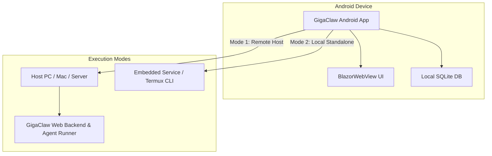

# Running GigaClaw on Android

Once the necessary Android project files (`GigaClaw.Android.csproj`, `MainActivity.cs`, `AndroidManifest.xml`, `MauiProgram.cs`) are added to the repository, here is the complete workflow to build, deploy, and run GigaClaw on an Android device or emulator.

---

## 1. Prerequisites & Environment Setup

### Install .NET MAUI Android Workload
Run the following in your terminal to install the .NET Android workload:
```bash
dotnet workload install maui-android
```

### Android SDK & Device Connection
Ensure you have an Android device connected via USB with **USB Debugging** enabled, or an Android Virtual Device (AVD) emulator running.

Verify connected devices:
```bash
adb devices
```

---

## 2. Building & Running via .NET CLI

### Option A: Run directly from Terminal on Connected Device / Emulator
You can build and deploy directly using `dotnet`:

```bash
/usr/local/share/dotnet/dotnet build GigaClaw.Android/GigaClaw.Android.csproj -t:Run -f net10.0-android
```

### Option B: Build APK & Manual Install via ADB
1. **Publish signed APK or AAB package**:
   ```bash
   /usr/local/share/dotnet/dotnet publish GigaClaw.Android/GigaClaw.Android.csproj -c Release -f net10.0-android
   ```

2. **Install APK to device via ADB**:
   ```bash
   adb install -r GigaClaw.Android/bin/Release/net10.0-android/publish/com.gigaclaw.app-Signed.apk
   ```

3. **Launch the application on Android**:
   ```bash
   adb shell am start -n com.gigaclaw.app/com.gigaclaw.app.MainActivity
   ```

---

## 3. Architecture & Execution Modes on Android

When running GigaClaw on Android, there are two primary architecture modes:



### Mode 1: Mobile Client (Recommended for AI Agent Dispatches)
- The Android app acts as a rich mobile interface to your main host machine (Mac/PC).
- Configured via `GIGACLAW_API_URL` (e.g. `http://192.168.1.50:5230` or a Tailscale IP).
- Heavy LLM dispatches and local Git repository watching run on your Mac/PC, while live status updates stream to your Android device via WebSockets / SSE.

### Mode 2: Local Standalone
- SQLite database (`TodoDbContext.cs`) runs locally on the Android file system (`Android.App.Application.Context.FilesDir`).
- The Blazor UI runs entirely inside native `BlazorWebView` without needing a web server process.
- Background tasks use an Android `ForegroundService` to keep Kanban column triggers and automation rules running in the background.

---

## 4. Viewing Logs & Debugging on Android

To view live application logs and diagnostics from the Android device:

```bash
# Filter logs for GigaClaw
adb logcat -s "GigaClaw:V" "*:E"
```

To inspect the Blazor UI DOM and Javascript console on the running app:
1. Open Chrome on your desktop (`chrome://inspect`).
2. Select your Android device and click **Inspect** under the GigaClaw WebView target.
