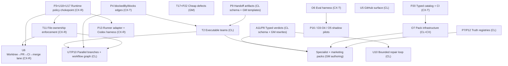

# GigaClaw Improvement Roadmap — Index

**Date:** 2026-07-30 · **Inputs:** three ecosystem analyses (Claude A−, Codex A, Gemini D), the 85-item three-model score reconciliation, and the 14-initiative multi-persona panel ranking (xlsx). Item IDs (P3, A11, T2, …) refer to the reconciliation's line items.

## Decision log (owner-approved 2026-07-30)

| Decision | Outcome |
|---|---|
| Baseline | Adjudicated tier ordering, cross-checked against the xlsx panel ranking, with the edits below |
| O7 modular agent packs | **Build** (panel wins over reconciliation's do-not-build) — required by the pack roadmap below |
| P13 second runner harness | **Build, narrow**: host-neutral runner interface + one proven second harness (Codex CLI). Serves the multi-model dispatch strategy directly |
| Specialist packs | Security Assurance, Incident & Debug, Architecture & Data, Language specialists. **Not** DevOps/k8s (no deploy target), ML/data-eng, business-ops, standalone accessibility |
| Marketing | Patterns (A11 verdicts, P7 registries) adopted in core. Optimized pack now: Email lifecycle, Launch orchestration, Social program, SEO/GEO deepening. Paid-ads + Influencer deferred to a later full-funnel completion, product-dependent |
| Plan home | Markdown docs only (this directory). Tickets created manually as work starts |
| Semantic memory (P16), model routing (O3/O4) | Later pilots, shadow mode, hard-gated on O6 — per both the panel and the reconciliation |
| Do-not-build | T15 consensus swarms, T16 federation, A14 queen agent, P14 GOAP, P17 signed receipts, O15 quantization, A12 business-ops. Unchanged |

## Lane model

Per owner direction: **Codex** takes the most complex surgical code changes (strength: detailed changes under ambiguity), **Claude** takes feedback-dependent and collaborative work (strength: collaboration and planning), **Gemini** takes the simplest highest-volume work (strength: speed).

| Lane | Tool | Doc | Scope (single-writer file boundaries) |
|---|---|---|---|
| CX-R Runtime | Codex + subagents | [lane-codex-runtime.md](lane-codex-runtime.md) | `GigaClaw.Core/Automation/` runner/policy internals (`ClaudeRunner.cs`, new `Policy/`, new `Runners/`), their tests. Changes to action vocabulary, ticket approval state, or member configuration require an explicit CL/shared merge window |
| CX-T Tooling | Codex + subagents | [lane-codex-tooling.md](lane-codex-tooling.md) | New catalog/eval projects, `tools/`, CI workflow; P4 persistence/API and board badge in the exact files listed by the lane doc. CL owns the `dependenciesResolved` automation condition |
| CL Orchestration | Claude Code + subagents | [lane-claude-orchestration.md](lane-claude-orchestration.md) | `automations.json`, `contracts.json`, engine trigger/action vocabulary, team services, verdict schemas, GitHub surface. Also owns cross-lane review + merge coordination |
| GM Volume | Gemini CLI | [lane-gemini-templates.md](lane-gemini-templates.md) | `ProjectTemplate/**` markdown (SKILL.md, memory stubs, references), `models.json` completion, pack content authoring |
| Packs & later | mixed | [packs-and-later.md](packs-and-later.md) | O7 pack infra, the five approved packs, P7 registries, later pilots, do-not-build |

Rules: each lane works in its own git worktree/branch (`lane/cx-runtime`, `lane/cx-tooling`, `lane/claude-orch`, `lane/gemini-vol`). A lane never edits another lane's files outside a documented merge window; cross-lane needs are raised as notes in the lane doc and resolved at sync points. Lane CL runs the merge queue: every lane branch is reviewed (five-axis) before merging to main. Existing tests must pass with `dotnet test GigaClaw.Core.Tests -c Release`; new projects must also be built and have their own tests invoked explicitly by CI.

## Lane status (living — updated by CL as the merge-queue owner)

**Last updated 2026-07-30.** Codex reached its weekly usage cap on 2026-07-30; lanes CX-R and CX-T are reassigned to Claude subagents working in the existing lane worktrees, under the same file boundaries and verification bar. Gemini keeps lane GM.

| Task | Lane | State | Where |
|---|---|---|---|
| R1 policy chokepoint | CX-R | Landed | `lane/cx-runtime` `cfbe9ab` |
| R2 shadow enforcement | CX-R | Landed — drain-lifecycle and Bash-boundary regressions covered, both proven load-bearing; 712 tests | `lane/cx-runtime` `1cf6a7a` |
| R3 block mode | CX-R | Gated — needs the SP-1 inventory to hold real dispatches (all 33 rows read `not-exercised`) and owner sign-off | — |
| T1 typed catalog | CX-T | Landed | `lane/cx-tooling` `4c404d1` |
| T2 catalog CI | CX-T | Drift + baseline checks running; strict binding gate still red on the `content-writer` gap until GM's G1 merges; drift script retires after a green week | `lane/cx-tooling` `4c404d1`, `5cbe6f5` |
| T3 dependency edges | CX-T | Landed | `lane/cx-tooling` `84e98ae` |
| T4 eval static layer | CX-T | Landed — 33 agents evaluated, `documentalist` flagged at 14,696 bytes | `lane/cx-tooling` `6a104da` |
| T5 eval replay | CX-T | In progress — replay and judge slices done (deterministic rubric judge is byte-reproducible and baselined; real-LLM judge is opt-in and informational); Monte Carlo deferred to its own slice | `lane/cx-tooling` |
| C1 verdict schema v1 | CL | Landed, frozen | `lane/claude-orch` |
| C2 verdict gate | CL | Vocabulary landed; per-reviewer wiring waits on G2 merging | `lane/claude-orch` |
| P4 CL half | CL | Landed | `claude-orch/p4-dependencies-resolved` |
| C6 handoff artifacts | CL | Landed — schema v1 frozen, dispatch injection wired, `ownedFiles` is the interface R4 leases consume | `lane/claude-orch` |
| G1 cheap defects | GM | Landed | `lane/gemini-vol` |
| G2 reviewer rewrites | GM | Under CL review — receipt-chain, cycle-counter and evaluator-transport findings fixed; two rubric findings outstanding | `lane/gemini-vol` |
| G3 handoff templates | GM | Unblocked by C6 — per-agent guidance for producing and consuming handoffs | — |

Open cross-lane items:

- Bash capability classification in R2 over-reports option flags as write targets and drops a capability when a read is redirected to a file; fixes are in flight in lane CX-R.
- R2's acceptance asks for durable ticket-comment receipts. That crosses the `ActionExecutor` boundary CL owns, so the branch records queryable run-log receipts instead and the criterion stays explicitly unmet until a shared merge window.
- `lane/cx-tooling` and branches based on it cannot be pushed to GitHub with the current credentials: they touch `.github/workflows/ci.yml` and the token lacks the `workflow` scope.

## Codebase validation (2026-07-30)

Validated against `origin/main` at `fe98829`. These findings are requirements, not optional implementation notes:

- Template-static truth is **33 direct child directories containing `SKILL.md`**, 33 contract entries, 29 automations (28 enabled), 12 explicit per-agent model mappings, 9 team definitions (the `all` pseudo-team plus 8 specialty teams), and 15 shared scripts. `ProjectTemplate/Agents/scripts/` is not an agent. Agents without an explicit mapping resolve through an action model or a configured project fallback; the catalog must report when that fallback is still required or unavailable.
- `content-writer` currently has no specialty-team membership. Catalog CI may report all missing bindings immediately, but the hard binding gate is enabled only after the owning GM/CL corrections land at SP-1. Deterministic generation/schema/drift checks gate from day one.
- The current contract schema has `dispatches`, `ticketExit`, `allowedWriteGlobs`, `riskClass`, and occasional `maxReviewCycles`; it has no network-expectation or enforcement-mode field. P3 starts by versioning and typing the real schema. Unknown risk classes fail closed in enforcement, and schema extensions are coordinated with CL.
- Claude `PreToolUse` hooks can govern Claude tool calls, but they cannot govern GigaClaw's host-side `httpRequest` automation action. U17 therefore has two boundaries: runner tool policy (CX-R) and an `ActionExecutor` preflight using trusted approval state (CL/shared merge window).
- A generated hook file is passed with `claude --settings`; it must be schema-validated and proven loaded because invalid print-mode settings may otherwise be ignored. The hook transport/helper and its latency benchmark are part of R2. `GigaClaw.ClaudeMock` must gain explicit hook emulation, or policy integration is tested separately; canned NDJSON replay alone does not execute hooks.
- File patterns match canonical workspace-relative paths. Absolute tool inputs are canonicalized only when they remain inside the workspace; outside paths, `..` escapes, and symlink escapes are rejected before glob matching. Case behavior is an explicit matcher option informed by the repository/filesystem, not assumed solely from the OS. Bash commands are capability-checked; they are not treated as reliably reducible to a single write path.
- R4 introduces a new durable SQLite lease table and reaper; existing concurrency locks are in memory. Worktrees isolate checkouts but do not make logically overlapping file leases disjoint.
- R5/R6 and R8 cross the original runner-only boundary: worktree flags and merge actions touch automation specs/execution and durable ticket state; harness selection touches member/config resolution. Those changes wait for the exact shared-file contracts in the lane doc.
- P4 is split deliberately: CX-T owns edge persistence, REST, ticket summary, and badge; CL owns automation condition vocabulary/evaluation. This removes the previous single-writer conflict.
- Eval mock replay can be deterministic; an LLM judge cannot be required to return an identical verdict. Real-judge runs record model/version/settings and use tolerance or remain informational. Committed baselines live under the eval project; ephemeral reports go to a gitignored artifact directory.

## Dependency graph

## Phases and sync points

**Phase 0 — Foundation** (parallel from day one)
CX-R: versioned contract model + policy evaluator (R1), then the R2 hook-transport/mock feasibility spike before shadow wiring. CX-T: P20 catalog + deterministic drift/schema CI; binding gaps are reported but become hard failures at SP-1 after GM/CL fixes. GM: T17 + P22 defects and model completion, then starts A11 SKILL rewrites against CL's schema. CL: A11 verdict schema (v1 frozen early so GM and CX aren't blocked), O6 spec for CX-T, contract extensions and the content-writer team correction.

**SP-1 gate:** catalog green with strict binding checks enabled · P3 shadow-mode glob-failure inventory reviewed by owner · contracts corrected · enforcement flipped warn→block only for reviewed agents · both defects closed. The inventory is a committed/generated report with one row per agent (including “not exercised”); every agent must have a fixture or recorded dispatch before it can be enabled in block mode.

**Phase 1 — Governance** — CL: verdict wiring + U10 repair loop. CX-T: O6 eval harness, baseline evals for all 33 agents. GM: finish reviewer rewrites, P9 handoff templates.

**SP-2 gate:** all five reviewers emit schema-valid verdicts, validated at the automation boundary · repair loop capped and escalating · `gigaclaw eval` baselines recorded.

**Phase 2 — Coordination** — CX-T: P4 dependency edges. CL: T2 executable teams, then U7/P10. CX-R: T11 ownership enforcement (needs P3 in block mode). GM: P21 progressive disclosure.

**SP-3 gate:** cycle detection, lease expiry, join semantics, ownership conflicts fail closed in integration tests. Parallel-execution features are now unlocked.

**Phase 3 — Throughput & reach** — CX-R: U6 worktree/merge lane, then P13 adapter + Codex harness. CL: U5 GitHub surface, T5/T6 review + debug team presets (with GM authoring).

**SP-4 gate:** one ticket flows worktree→PR→CI→owner merge end-to-end · second harness reaches parity on streaming/resume/policy for one agent and reports usage/cost or an explicit unsupported capability.

**Phase 4 — Packs** — O7 infra first (CL design, CX-T impl), Security Assurance pack proves it, then Incident & Debug, Architecture & Data, Language specialists, P7 registries, Marketing pack. Mostly GM volume authoring with CL wiring. Then later pilots (see [packs-and-later.md](packs-and-later.md)).

## Risks

| Risk | Impact | Mitigation |
|---|---|---|
| P3 block mode breaks most dispatches (wrong globs) | High | Shadow mode first; inventory is the deliverable; flip per-agent, not global |
| Hook settings/helper silently fail or exceed latency budget | High | Validate generated settings, prove hook receipt in integration tests, benchmark the chosen transport before R2 |
| Host-side outbound action bypasses runner hooks | High | Separate runner tool policy from `ActionExecutor` preflight; default host outbound to dry-run until trusted approval state exists |
| `automations.json`/`contracts.json` contention across lanes | Med | Single writer (CL); other lanes propose via lane-doc notes |
| Verdict schema churn stalls GM rewrites | Med | Freeze schema v1 at Phase 0 end; additive changes only until SP-2 |
| Codex harness parity underestimated (resume/steering/cost) | Med | Parity checklist in P13 task; one agent first; fall back to external-worker-only |
| Pack sprawl repeats the catalog anti-pattern | Med | Every pack agent ships fully bound (contract, model, team, automation, eval baseline) — enforced by P20 CI |
